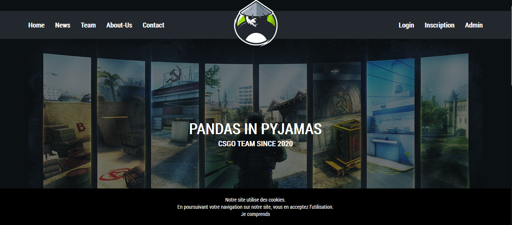

# Pandas In Pyjamas

## Version

Ceci est la version 1.0 du site de l'équipe "Pandas In Pyjamas".

## Auteur

Davy Biron

## Description

Ceci est un projet de fin d'année en structure MVC pour l'obtention du dîplome de Developpeur Web.
Les languages utilisés sont : 
* Html
* Css
* Javascript
* JQuery
* Php

Le sujet :

Le projet est un site présentant une équipe Esport évoluant sur le jeux "Counter-Strike Global Offensive".

On pourra notemment retrouver : 
* Les news sur l'évolution de la team.
* Une page présentant les membres de la team avec une api qui permet d'afficher leurs stats sur ce jeux.
* Une section membre qui permet de s'inscrire sur le site afin de commenter les différentes news.
* Les liens vers les différents sponsors ainsi que vers les réseaux sociaux.
* Une page de contact afin d'envoyer un mail à l'équipe.
* Une section Administration permettant de créer/modifier/supprimer des news.

## Pour obtenir une copie du projet

Ces instructions vont vous permettre d'obtenir une copie du projet sur votre machine afin de faire vos tests.

### Prérequis

* Un simple navigateur internet
* Un éditeur de code, comme par exemple "[Visual Studio Code](https://code.visualstudio.com/)".
* Une application de gestion de Base de Données, comme par exemple "[Laragon](https://laragon.org/)" ou "[phpMyAdmin](https://www.phpmyadmin.net/)".
* Pour que tout fonctionne correctement, vous aurez également besoin d'avoir "composer" d'installer sur votre machine. Si ce n'est pas le cas, vous pouvez le trouver "[ici](https://getcomposer.org/)".

### Installation

Téléchargez simplement le projet via son "[github](https://github.com/dbiron/PandasInPyjamas)".
En ce qui concerne la base de données, vous pourrez la trouver dans le dossier "app/data/bdd.sql". Ensuite, vous pourrez l'importer dans laragon ou phpMyAdmin.
Le diagramme sql quand à lui, se trouve dans le dossier "app/data/diagramme.png"

Une fois tout ceci fait, vous pouvez naviguer dans le projet en l'ouvrant avec visual studio code par exemple.

## Pour lancer le projet en local

Afin de lancer le projet en local une fois celui-ci téléchargé, lancez tout d'abord phpMyAdmin ou laragon.
Ensuite ouvrez notre navigateur internet préféré et tapez dans la barre d'adresse "pip.test" ou encore "localhost/pip".
